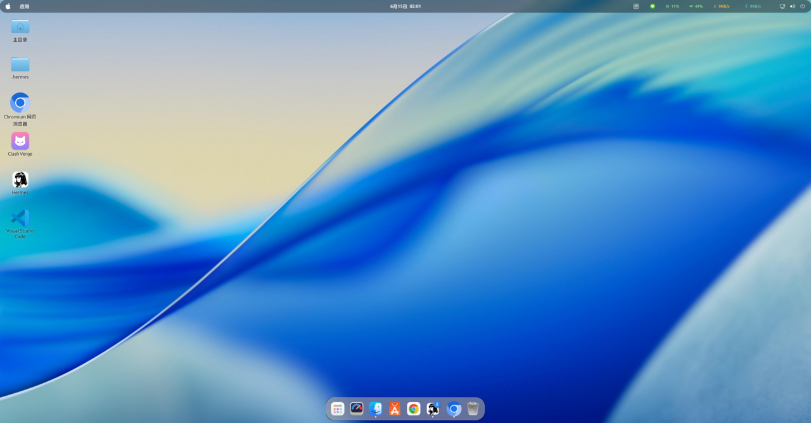
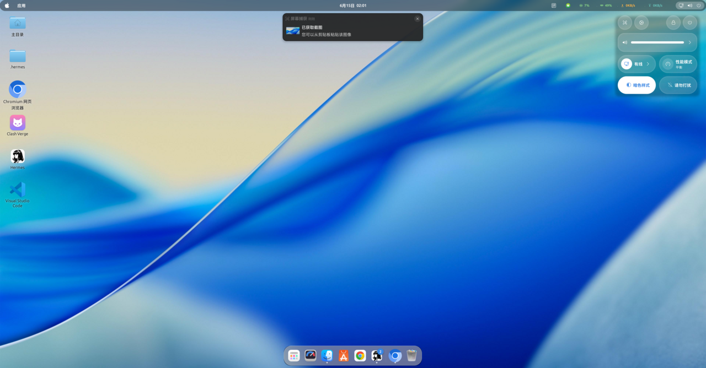
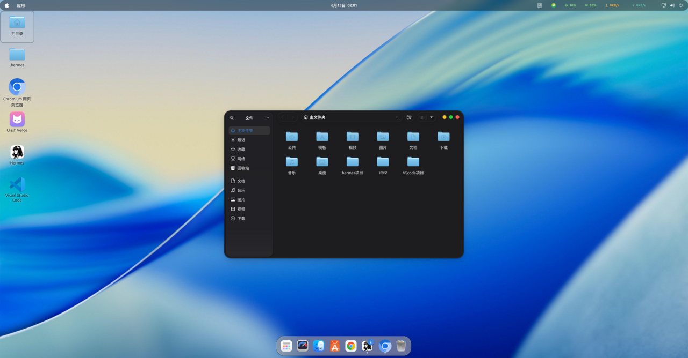
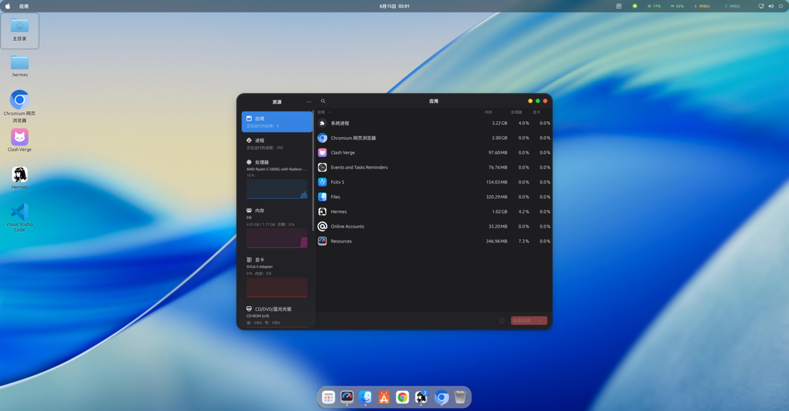
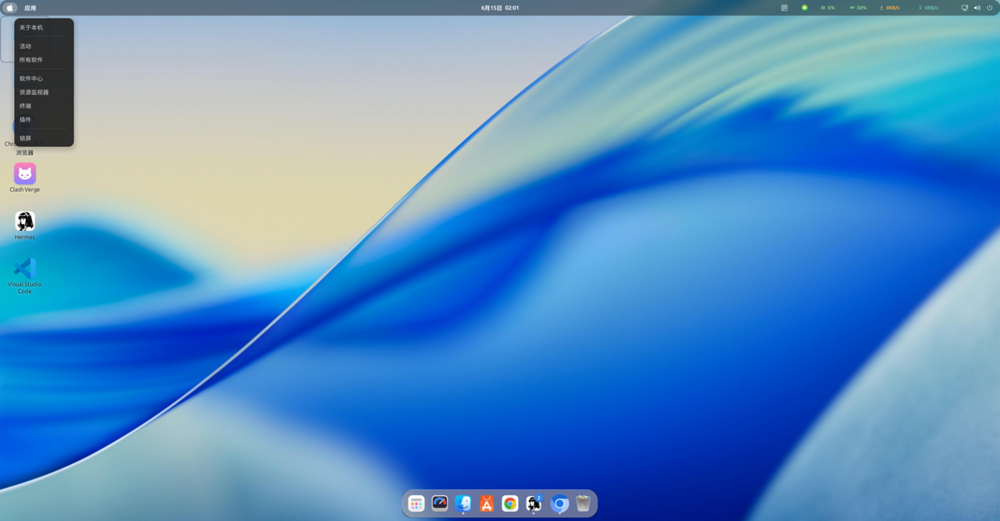
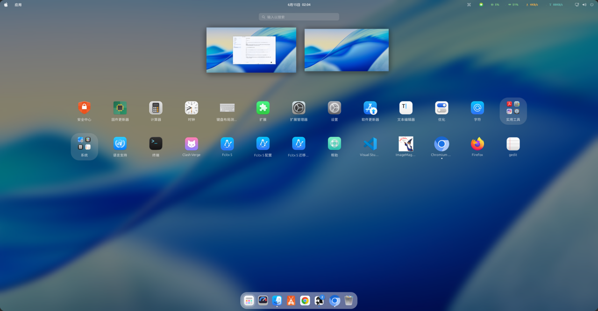

# 🖥️ macOS 风格桌面 — 完整离线备份

**来源**：Ubuntu 26.04 LTS (Resolute Raccoon) · GNOME Shell 50.1 · GTK 4.22 · Wayland  
**兼容**：Ubuntu 24.04+ / GNOME 46+

全新系统 → 一条命令恢复完全一致的 macOS 风格，无需联网。

---

## 效果展示

| 桌面 | Dock 和窗口 |
|------|------------|
|  |  |

| 应用概览 | Nautilus |
|----------|----------|
|  |  |

| 设置 | 锁屏 |
|------|------|
|  |  |

---

## 一键恢复

```bash
git clone https://github.com/heidis168/macos-theme-backup.git
cd macos-theme-backup
chmod +x bootstrap.sh restore.sh
./bootstrap.sh
# 完成后：注销 → 重新登录
```

---

## 恢复内容详解

### 🎨 GTK 主题（24 变体）

| 主题 | Light (6) | Dark (6) | 特性 |
|------|-----------|----------|------|
| **MacTahoe** | Light / hdpi / xhdpi / solid / solid-hdpi / solid-xhdpi | Dark / hdpi / xhdpi / solid / solid-hdpi / solid-xhdpi | 窗口模糊 + 圆角 |
| **WhiteSur** | Light / hdpi / xhdpi / solid / solid-hdpi / solid-xhdpi | Dark / hdpi / xhdpi / solid / solid-hdpi / solid-xhdpi | 经典 WhiteSur 风格 |

- DPI 适配：普通 (1x) / hdpi (2x) / xhdpi (3x)
- solid 版本：不透明窗口，性能优先
- 来源：[vinceliuice/MacTahoe-gtk-theme](https://github.com/vinceliuice/MacTahoe-gtk-theme) + WhiteSur

### 🎨 Shell 主题

- **MacTahoe-Dark** 全局 Shell 主题
- 顶栏左上角 🍎 Apple logo（自定义 GNOME Shell 扩展实现）
- 窗口按钮：左侧 macOS 风格排列 `⚫⚫⚫`（关闭/最小化/最大化）

### 🎨 图标主题

| 图标 | 大小 | 内容 |
|------|------|------|
| MacTahoe | 128MB | 完整应用图标 + 文件夹 + MIME + 状态图标 |
| MacTahoe-dark | — | 深色面板专用变体 |
| MacTahoe-light | — | 浅色面板专用变体 |
| MacTahoe 光标 | 包含 | macOS 风格鼠标指针 |

来源：[vinceliuice/MacTahoe-icon-theme](https://github.com/vinceliuice/MacTahoe-icon-theme)

### 🔐 GDM 登录主题

- MacTahoe GDM 主题（需 root）
- 登录界面与桌面风格统一

### 🍎 Plymouth 启动界面

- **fathyar/mac-plymouth** — 仿 macOS 启动动画
- 白色 🍎 logo + 黑色背景 + 底部进度条
- 关机动画帧（6 帧软链至 boot.png）
- `update-alternatives` 优先级 200（高于系统默认 bgrt 110）
- 安装位置：`/usr/share/plymouth/themes/mac/`

### 🔤 字体

| 字体 | 用途 | 文件 |
|------|------|------|
| San Francisco Display Bold 13 | 标题栏 | 21 个 .otf |
| San Francisco Text | 系统界面（可选） | 包含在内 |

### 🧩 GNOME Shell 扩展（6 个第三方）

| 扩展 | UUID | 作用 |
|------|------|------|
| **Blur My Shell** | `blur-my-shell@aunetx` | 面板/Dock/概览 毛玻璃模糊效果 |
| **Logo Menu** | `logomenu@aryan_k` | 顶栏左上 Apple logo + 系统菜单 |
| **System Monitor** | `sysmonitor@talhasiddique7` | 顶栏 CPU/内存/网络实时监控 |
| **User Themes** | `user-theme@...gcampax.github.com` | 启用 Shell 主题加载 |
| **Add to Desktop** | `add-to-desktop@tommimon.github.com` | 右键发送快捷方式到桌面 |
| **App Hider** | `app-hider@lynith.dev` | 隐藏指定应用窗口 |

**系统自带已启用**：

| 扩展 | 作用 |
|------|------|
| `ubuntu-dock@ubuntu.com` | Dock (Dash-to-Dock) |
| `ding@rastersoft.com` | 桌面图标 |
| `tiling-assistant@ubuntu.com` | 窗口平铺辅助 |
| `ubuntu-appindicators@ubuntu.com` | 托盘图标 |

### ⚙️ gsettings 配置（55+ 界面键 + 48 Dock 键）

| 分类 | 键数 | 示例 |
|------|------|------|
| 界面 | 22 | gtk-theme, icon-theme, color-scheme, font-name, clock-format… |
| WM | 14 | button-layout, titlebar-font, focus-mode… |
| Dock | 48 | dock-position, icon-size, extend-height, blur, autohide… |
| Mutter | 9 | center-new-windows, edge-tiling… |
| 其他 | 16 | touchpad, screensaver, background… |

**关键 Dock 设置**：
```
dock-position: BOTTOM        # 底部居中
extend-height: false         # macOS 风格（不占满）
always-center-icons: true    # 图标居中
show-apps-at-top: true       # 应用抽屉在左侧
autohide: false              # 始终显示
background-opacity: 0.15     # 半透明
```

### 💾 dconf 扩展配置

Blur My Shell、Logo Menu、DING 等扩展的**内部配置不在 gsettings**，通过 dconf dump 完整备份：

| 路径 | 内容 |
|------|------|
| `blur-my-shell/` | 面板/Dock/概览/锁屏 模糊参数 (sigma=30, brightness=0.6) |
| `Logo-menu/` | Apple logo 显示/隐藏、菜单项配置 |
| `ding/` | 桌面图标排列方式、显示/隐藏垃圾桶 |
| `dash-to-dock/` | Dock 透明度、指示器样式 |
| `tiling-assistant/` | 平铺热区、间隔 |

### 🖼️ GTK4 CSS

```
~/.config/gtk-4.0/
├── gtk.css / gtk-dark.css          # 窗口背景透明度
├── gtk-Light.css / gtk-Dark.css    # libadwaita 覆盖
├── assets/                         # 127 滑块/勾选框/单选框图标
└── windows-assets/                 # 80 窗口按钮图标 (close/min/max)
```

### 🖼️ 壁纸

- MacTahoe-day.jpeg (3840×2160) — macOS 风格抽象壁纸
- 锁屏与桌面统一壁纸

---

## 备份目录结构

```
macos-theme/
├── bootstrap.sh              # 全新系统引导安装（自动安装依赖）
├── restore.sh                # 仅恢复配置（已有主题时用）
├── quick-setup.sh            # 快速设置（最小安装）
├── README.md
├── screenshots/              # 效果预览截图 (5 张)
├── configs/
│   ├── gtk-settings.txt      # gsettings 键值对（schema key = value）
│   ├── dock-settings.txt     # dash-to-dock 全部非默认键 (48)
│   ├── dconf/
│   │   ├── extensions.conf   # 扩展内部配置
│   │   ├── background.conf   # 桌面背景
│   │   ├── screensaver.conf  # 锁屏
│   │   └── full-dconf.conf   # 完整 dconf dump
│   ├── gtk4-css/             # GTK4 CSS + assets + windows-assets
│   └── wallpapers/           # 当前壁纸文件
├── themes-installed/         # 预编译 GTK 主题（24 变体，cp 即可）
├── themes/                   # 主题源码（可选，用于重编译）
├── extensions/               # 第三方扩展文件夹 (6)
├── fonts/                    # San Francisco 字体 .otf (21)
├── plymouth/                 # macOS 风格启动界面
│   ├── install.sh
│   └── mac/
└── configs/icon-cache/       # 图标缓存
```

---

## bootstrap.sh 安装流程（8 步）

```
① 系统依赖    → apt install gnome-shell-extensions sassc gnome-tweaks imagemagick
② GTK 主题    → cp themes-installed/ → ~/.themes/（预编译，跳过 install.sh）
③ Shell 扩展  → cp extensions/ → ~/.local/share/gnome-shell/extensions/
④ 图标主题    → cd themes/MacTahoe-icon-theme && ./install.sh
⑤ Shell 主题  → cd themes/MacTahoe-gtk-theme && ./install.sh -l --round -i apple
⑥ Plymouth    → sudo cp plymouth/mac → /usr/share/plymouth/themes/ + update-initramfs
⑦ GDM 登录    → sudo tweaks.sh -g
⑧ 配置恢复    → restore.sh（字体 → gsettings → dconf → GTK4 CSS → 壁纸）
```

**完成后 → 注销 → 重新登录**（Wayland 下必须物理注销，SSH 无法远程重启 Shell）

---

## 系统依赖

`bootstrap.sh` 自动安装：
```
gnome-shell-extensions  sassc  gedit  gnome-tweaks
gnome-shell-extension-manager  imagemagick
```

---

## 常见问题

| 问题 | 原因 | 解决 |
|------|------|------|
| 面板无模糊 | Blur My Shell 未启用或 dconf 未恢复 | `dconf load / < full-dconf.conf` + 重启 Shell |
| 扩展未启用 | 复制文件夹 ≠ Shell 自动识别 | `gsettings set enabled-extensions "[...]"` + `killall -3 gnome-shell` |
| Shell 主题不生效 | User Themes 扩展未启用 | 在 Extensions 应用中开启 User Themes |
| 壁纸路径错误 | 硬编码了旧用户名 | restore.sh 中 `sed "s|/home/旧用户|$HOME|g"` |
| 窗口不圆角 | Blur My Shell panel/corner-radius=0 覆盖 | `dconf write ...corner-radius 32` |
| 启动界面不显示 | 未 update-initramfs | `sudo update-initramfs -u` |
| 启动显示 Ubuntu logo 而非苹果 logo | **主题装到了非标准目录名(如 mac-improved)** → Ubuntu initramfs hook 只为标准目录复制 PNG 资源，boot.png 缺失，plymouth 回退默认 logo | 必须装到 `/usr/share/plymouth/themes/**mac**/`(标准名)，再 `update-initramfs -u`；验证 `lsinitramfs /boot/initrd.img-$(uname -r) \| grep mac/boot.png` 应有输出 |
| 启动界面一闪而过看不见 | NVMe 等快速硬件 + `GRUB_TIMEOUT=0` | `plymouthd.conf` 设 `DeviceTimeout=8`，并把 `GRUB_TIMEOUT` 改为 3 后 `update-grub` |
| 开机先滚动一堆代码/文字再出 logo | 内核命令行去掉了 `quiet`，或加了 `plymouth.debug`（通常是调试残留） | 确保 `/etc/default/grub` 的 `GRUB_CMDLINE_LINUX_DEFAULT="quiet splash"`，去掉 `plymouth.debug`，再 `sudo update-grub` |
| 登录界面(GDM)显示 Ubuntu logo 而非苹果 | MacTahoe GDM 主题被系统更新重置，Yaru gresource 还原回 Ubuntu 默认 | 重跑 `sudo themes/MacTahoe-gtk-theme/tweaks.sh -g -i apple`，再重启 GDM/整机；验证 Yaru `gnome-shell-theme.gresource` 旁有 `.bak` 且本体被更新 |
| 登录框底部中央仍是 Ubuntu 橙色 logo | 该 logo 由 `org.gnome.login-screen.logo` 控制，Ubuntu 在 `10_ubuntu-settings.gschema.override` 硬编码成 `ubuntu-logo-text-dark.svg`，优先级高于 `greeter.dconf-defaults` | 用标准 dconf profile 覆盖：建 `/etc/dconf/profile/gdm`(含 `system-db:gdm`) + `/etc/dconf/db/gdm.d/01-apple-logo`(设 `logo='/usr/share/pixmaps/apple-logo-white.svg'`) + `sudo dconf update`；验证 `DCONF_PROFILE=gdm dconf read /org/gnome/login-screen/logo` |
| 恢复后"缺少组件" | 只恢复了 gsettings，dconf/文件缺失 | 确认完整执行 restore.sh 三层 |

---

## 技术要点

- **三层备份模型**：gsettings（键值）+ dconf（扩展配置）+ 物理文件（主题/字体/图标）
- **install.sh 无声失败**：Ubuntu 26.04 上 vinceliuice GTK 主题编译偶尔失败，故用预编译包直接 `cp`
- **符号链接处理**：shutdown[1-6].png → boot.png（Plymouth 关机帧，节省空间）
- **路径变量化**：restore.sh 自动替换 `/home/旧用户` → `$HOME`
